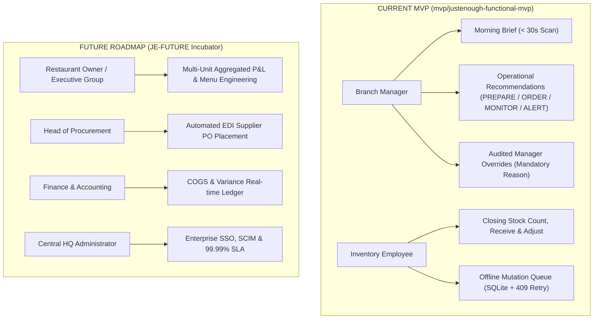

# JustEnough Product Classification & Roadmap (V6.1)

## 1. Product Classification: Functional / Demo-Ready MVP

JustEnough is formally classified as a **Functional / Demo-Ready MVP**.
It is explicitly **NOT**:
- An enterprise production multi-tier SaaS platform.
- An SLA-backed 24/7 mission-critical cloud platform.
- A full-featured ERP / accounting replacement.

### The Single Core Product Question
Every feature in the MVP directly answers:
> **"What should this restaurant prepare, order, and monitor next?"**

---

## 2. Personas & Scope Boundary

---

## 3. Detailed MVP Feature Matrix (In-Scope)

| Feature | Target Persona | Value Proposition | Implementation Details |
|---------|----------------|-------------------|------------------------|
| **7-Day Menu Demand Forecast** | Branch Manager | Accurate daily item forecast driven by ML | Upstream LightGBM regressor on `log1p(quantity)` with 52 features. |
| **Recipe / BOM Translation** | Branch Manager / Kitchen | Automatic conversion of menu item demand into ingredient quantities | Recipe mapping with yield factor accounting. |
| **Morning Brief Screen** | Branch Manager | Glanceable operational brief in < 30 seconds | High-priority PREPARE, ORDER, MONITOR, and ALERT action cards. |
| **Manager Overrides** | Branch Manager | Flexibility to adjust AI recommendations based on local intuition | Audited decision log storing old value, new value, and mandatory reason. |
| **Explainability View** | Branch Manager | Trust and transparency into why demand is elevated or depressed | Breakdown of historical base, safety stock buffer, and event signals. |
| **Stock Count & Adjust** | Inventory Employee | Quick daily cycle counting at branch closing | Mobile form recording actual closing stock against snapshots. |
| **Offline Sync Queue** | Inventory Employee | Reliability during basement/kitchen WiFi dropouts | Local SQLite queue with exponential retry and HTTP 409 conflict handling. |
| **CSV Sales Ingestion** | Branch Manager | Fast ingestion of POS sales exports | Streaming CSV parser with dead-letter queue for invalid rows. |

---

## 4. JE-FUTURE Roadmap: Incubator Backlog

The following initiatives are categorized under the `JE-FUTURE` incubator and intentionally excluded from the MVP scope:

### Phase 2: Multi-Unit Operations (Q1 2027)
- **Central Commissary BOM Planning**: Aggregating prep requirements across multiple city branches to optimize central kitchen batch cooking.
- **Inter-Branch Stock Transfers**: Balancing surplus perishable stock between adjacent branches before expiration.
- **Enterprise Role-Based Access Control (RBAC)**: Fine-grained permissions separating branch managers, area coaches, and regional directors.

### Phase 3: Automated Supplier Procurement (Q2 2027)
- **Automated Purchase Orders**: Direct EDI and WhatsApp bot integration with food distributors (e.g. Al Ahram Foods).
- **Dynamic Vendor Lead-Time Tracking**: Automatically updating safety stock buffers based on supplier historical delivery delays.
- **Contract Price Compliance**: Flagging invoice price discrepancies against negotiated supplier agreements.

### Phase 4: Financial & Menu Intelligence (Q3 2027)
- **Real-Time Food Cost Variance (COGS)**: Comparing theoretical usage (from POS sales & BOM) vs actual usage (from stock counts) to isolate shrinkage and theft.
- **Menu Engineering Matrix**: Classifying dishes into Stars, Plowhorses, Puzzles, and Dogs based on gross margin and forecast velocity.
- **Automated Expiration & Dynamic Markdown Engine**: Suggesting daily specials or flash discounts on items nearing shelf-life limit.
